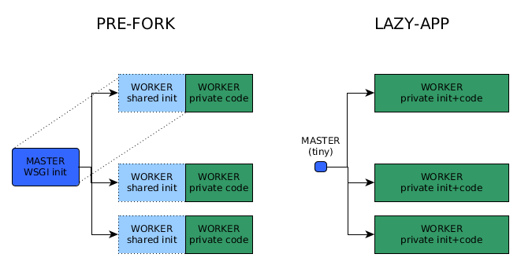
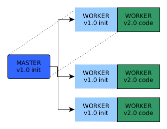
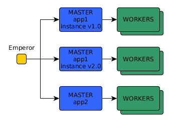
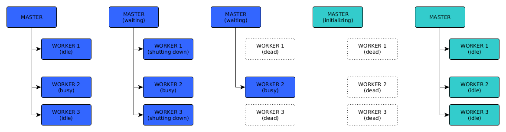
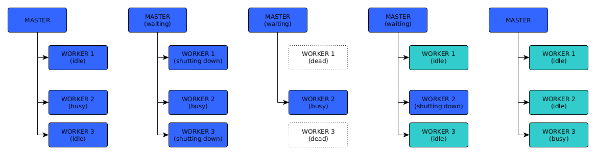
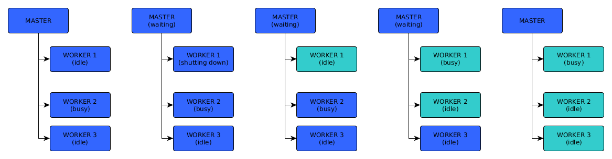
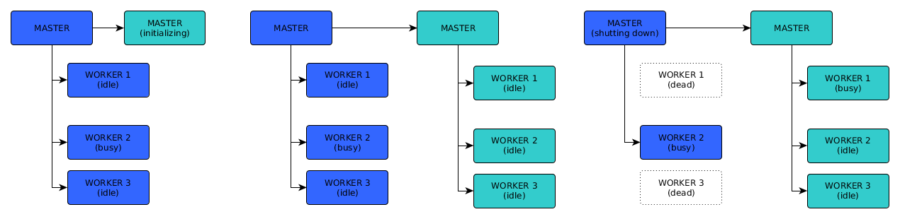
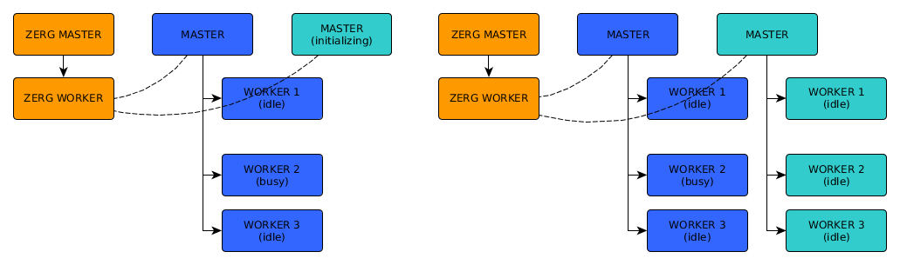

# uWSGI Graceful Deploy

---


## 重载，优雅重载

### 重载模式一： 暴力停止实例，启动实例。

```shell
Brutally killing worker 2 (pid: 17245)...
Brutally killing worker 1 (pid: 17244)...
goodbye to uWSGI.
...
spawned uWSGI worker 1 (pid: 9446, cores: 100)
spawned uWSGI worker 2 (pid: 9450, cores: 100)
...
```

问题:
1. 两个阶段之间的时间片将给你的客户带来粗鲁的无服务。
2. 强行断开正在执行的请求潜在破坏数据完整性。

### 重载模式二：优雅停止实例，启动实例。
```shell
Gracefully killing worker 2 (pid: 83388)...
dealing with ongoing request...
Gracefully killing worker 1 (pid: 83387)...
waiting for 1 running requests on worker 1 (pid: 83387)
goodbye to uWSGI.
...
spawned uWSGI worker 1 (pid: 9446, cores: 100)
spawned uWSGI worker 2 (pid: 9450, cores: 100)
...
```

解决问题： 2。

遗留问题： 1。


### 重载模式三: 优雅重载。
    
重载期间请求无错误，无等待。解决问题 1&2。


## uWSGI 重载

---


### 工作原理与理论背景


uWSGI 提供两种启动应用程序的模式：Pre-fork(default), Lazy-app



Pre-fork：uWSGI在第一个进程中加载整个应用，然后在加载完应用之后，多次 fork() 自己。

    优点: 更少的资源使用，更少的启动时间;
    缺点: 每当你的修改代码时，该模式迫使你重载整个栈，而不是只重载 worker。

Lazy-app: 对每个 worker 加载应用一次。

    优点: 运行在一个更加一致干净的环境中。
    缺点: 将需要大约O(n)次加载 (其中，n 是 worker 数)，非常有可能会消耗更多内存。

Pre-fork 和 Lazy-app 代码部署上的区别 (only workers or (master and workers)):




#### Emperor mode（皇帝与封臣, 多实例应用部署）

它是一个负责启动/停止其他 uWSGI 进程（称为 vassals ）的小进程。
通过简单的创建/删除 .ini 文件来创建/关闭应用。




### uWSGI 进程管理 (信号 与 unix命名管道)

#### 一. Signals for controlling uWSGI

|  Signal   | Description  | Convenience command|
|  ----  | ----  | ----- |
| SIGHUP  | gracefully reload all the workers and the master process | --reload
| SIGTERM  | brutally reload all the workers and the master process | (use --die-on-term to respect the convention of shutting down the instance)
| SIGINT  | immediately kill the entire uWSGI stack | --stop
| SIGQUIT  | immediately kill the entire uWSGI stack | 
| SIGUSR1  | print statistics |
| SIGUSR2  | print worker status or wakeup the spooler | 
| SIGURG  | restore a snapshot |
| SIGTSTP  | pause/suspend/resume an instance | 
| SIGWINCH  | wakeup a worker blocked in a syscall (internal use) | 
| SIGFPE  | generate C traceback | 
| SIGSEGV  | generate C traceback | 


#### 二. The Master FIFO (unix命名管道 (fifo))

使用  --master-fifo filename, 告诉 master 创建一个UNIX命名管道 (FIFO)，用它来发布命令给 master。

```
# 创建
uwsgi --master-fifo=/tmp/yourfifo 其他参数
# 发送命令给master
echo r > /tmp/yourfifo
```

小知识：FIFO 创建于非阻塞模式，并且在每次客户端断连的时候由 master 重新创建，且只有运行master的uid才有fifo的写权限。


##### Available commands
```
‘0’ to ‘9’ - set the fifo slot (see below)
‘+’ - increase the number of workers when in cheaper mode (add --cheaper-algo manual for full control)
‘-’ - decrease the number of workers when in cheaper mode (add --cheaper-algo manual for full control)
‘B’ - ask Emperor for reinforcement (broodlord mode, requires uWSGI >= 2.0.7)
‘C’ - set cheap mode
‘c’ - trigger chain reload
‘E’ - trigger an Emperor rescan
‘f’ - re-fork the master (dangerous, but very powerful)
‘l’ - reopen log file (need –log-master and –logto/–logto2)
‘L’ - trigger log rotation (need –log-master and –logto/–logto2)
‘p’ - pause/resume the instance
‘P’ - update pidfiles (can be useful after master re-fork)
‘Q’ - brutally shutdown the instance
‘q’ - gracefully shutdown the instance
‘R’ - send brutal reload
‘r’ - send graceful reload
‘S’ - block/unblock subscriptions
‘s’ - print stats in the logs
‘W’ - brutally reload workers
‘w’ - gracefully reload workers
```


## uWSGI 重载方式

---

### 1. re-exec master ("r")



重载流程:
1. master 会优雅的一次性关闭所有 worker

2. 等到所有 worker 都下线
   
3. 重新执行自身 - 基本上，在同一进程中运行新代码
   
4. 生成新的 worker

服务不可用时间：busy-worker-shutdown + init

重载需要的时间：busy-worker-shutdown + init

master 是否重启: 是


### 2. restart workers ("w")



重载流程:
1. master 会优雅的一次性关闭所有 worker

2. 当一个 worker 关闭后，它会立即重新生成
   
3. 直到所有 worker 都重新生成

服务不可用时间：busy-worker-shutdown + init

重载需要的时间：busy-worker-shutdown + init

master 是否重启: 否（和 pre-fork 模式不兼容）


### 3. chain restart workers ("c")



重载流程:

1. master 将一次优雅地关闭一个 worker
2. 当一个 worker 关闭后，它会立即重新生成
3. 直到所有 worker 都重新生成

服务不可用时间：0

重载需要的时间：~ N x (busy-worker-shutdown + init)

master 是否重启: 否（和 pre-fork 模式不兼容）


### 4. fork master ("f")



重载流程:
1. fork 新 master
2. 新 master 初始化完成后，它会派生新的 worker
3. 旧 master 被告知关机
4. 旧 master 会等到最后一个忙碌的 worker 完成请求

服务不可用时间：0

master 是否重启: 是

重载需要的时间：~ init + busy-worker-shutdown

需要启动多实例，且该模式和 Emperor 不兼容


### 5. Zerg dance



重载流程:
1. 启动新实例（封臣）
2. 初始化完成后，它会派生新的 worker
3. 旧 master 被告知关机
4. 旧 master 会等到最后一个忙碌的 worker 完成请求

服务不可用时间：0

重载需要的时间：~ init + busy-worker-shutdown

master 是否重启: 是

需要管理多实例，可用 Emperor 部署


### 总结

    有停机时间："r"/"w" - 他们在启动前关闭（"r"有更长的停机时间）
    
    pre-fork 不兼容："w"/"c" - 他们不会重新启动 master
    
    混合响应："c" - 它同时有新旧空闲 worker
    
    内存重："f"/Zerg - 它们并排生成完整副本
    
    不兼容 Emperor："f" - 不能让旧 master 重新生成 worker


## 示例
```shell
1. 优雅关闭, 但有不可用时间
2. 优雅重载之链式重启模式 (c 模式)
3. 优雅重载之 zerg dance 模式
```

###  测试使用脚本

```python
# -*- coding: utf8 -*-

import time
from flask import Flask

app = Flask(__name__)


@app.route('/v1/hello_world')
def index():
    return 'Hello World'


@app.route('/v1/long_request')
def long_request():
    delayed_seconds = 10
    for i in range(delayed_seconds, 0, -1):
        print('Please waiting for {} seconds.'.format(i))
        time.sleep(1)

    return f'This data delayed {delayed_seconds} seconds.'
```

uwsgi.ini
```ini
[uwsgi]
master         = true
master-fifo    = .uwsgi.fifo
processes      = 2
enable_threads = true
threads        = 10
http-socket    = :8888
chmod-socket   = 666
wsgi-file      = server.py
callable       = app
```

#### 1. 优雅关闭, 但有不可用时间。

```shell
# 启动服务器
# $ cd uwsgi/demo
$ uwsgi uwsgi.ini
spawned uWSGI master process (pid: 28208)
spawned uWSGI worker 1 (pid: 28209, cores: 10)
spawned uWSGI worker 2 (pid: 28210, cores: 10)

# 发送请求
$ curl localhost:8888/v1/long_request

# 发送重启信号
$ echo r > .uwsgi.fifo
...gracefully killing workers...
Gracefully killing worker 1 (pid: 28209)...
Gracefully killing worker 2 (pid: 28210)...
...
gracefully (RE)spawned uWSGI master process (pid: 28208)
spawned uWSGI worker 1 (pid: 28374, cores: 10)
spawned uWSGI worker 2 (pid: 28375, cores: 10)
```

#### 2. 优雅重载之链式重启模式 (c 模式)
```ini
[uwsgi]
lazy-apps      = true
其他参数...
```

```shell
# 启动服务器
# cd uwsgi/demo
$ uwsgi uwsgi.ini
spawned uWSGI master process (pid: 29741)
spawned uWSGI worker 1 (pid: 29742, cores: 10)
spawned uWSGI worker 2 (pid: 29743, cores: 10)

# 发送请求
$ curl localhost:8888/v1/long_request

# 发送重启信号
# cd uwsgi/demo
$ echo c > .uwsgi.fifo
chain reload starting...
Gracefully killing worker 1 (pid: 29742)...
worker 1 killed successfully (pid: 29742)
Respawned uWSGI worker 1 (new pid: 29798)
Gracefully killing worker 2 (pid: 29743)...
worker 2 killed successfully (pid: 29743)
Respawned uWSGI worker 2 (new pid: 29803)
chain reloading complete
...
```

#### 3. 优雅重载之 zerg dance 模式

```shell
$ cd uwsgi/demo
$ mkdir vassal
```
vassal.ini
```ini
[uwsgi]
chdir          = /Users/vino/Workspace/dream/docs/uwsgi/demo
processes      = 2
enable_threads = true
threads        = 10
http-socket    = vassal/server.sock
chmod-socket   = 666
wsgi-file      = server.py
callable       = app
zerg            = vassal/zergpool
stats           = %n.stats
thunder-lock    = true

hook-accepting1-once = write:vassal/%n.ready ok
hook-as-user-atexit = unlink:vassal/%n.ready
```

vassal/zerg.ini
```ini
[uwsgi]
chdir          = /Users/vino/Workspace/dream/docs/uwsgi/demo
master         = true
socket         = vassal/zergpool.sock
chmod-socket   = 666
zergpool       = vassal/zergpool:vassal/server.sock
```

###  运行 Emperor 多实例
```shell
# 启动 Emperor
$ uwsgi --emperor vassal
# 添加启动实例
$ cp vassal.ini vassal/app1.ini
# 再次添加实例
$ cp vassal.ini vassal/app2.ini

# 删除实例
# rm vassal/app1.ini
```


## 进程管理工具

### 一. Supervisor

一. 设计理念:

supervisord 的主要目的是根据其配置文件创建和管理进程。 它通过创建子进程来做到这一点。 
supervisor 生成的每个子进程在其整个生命周期内都由 supervisord 管理（supervisord 是它创建的每个进程的父进程）。 
当一个子进程退出后，操作系统会通过 SIGCHLD 信号通知 supervisor 其死亡，并执行相应的操作。

重点：基于父子进程管理，而非直接基于进程管理。

二. supervisorctl 惯用重载命令 restart 并非是一般意义上的重载， 而是粗暴的当成 “停止实例，启动实例”。
```shell
supervisor> restart xxx
xxx: stopped
xxx: started
```

### 二. Systemd


## 参考文档

[The Art of Graceful Reloading](https://uwsgi-docs.readthedocs.io/en/latest/articles/TheArtOfGracefulReloading.html)

[Managing the uWSGI server](https://uwsgi-docs.readthedocs.io/en/latest/Management.html)

[The Master FIFO](https://uwsgi-docs.readthedocs.io/en/latest/MasterFIFO.html)

[The uWSGI Emperor – multi-app deployment](https://uwsgi-docs.readthedocs.io/en/latest/Emperor.html)

[Zerg mode](https://uwsgi-docs.readthedocs.io/en/latest/Zerg.html)